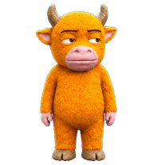
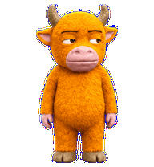
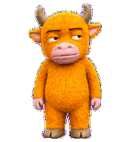
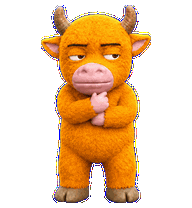
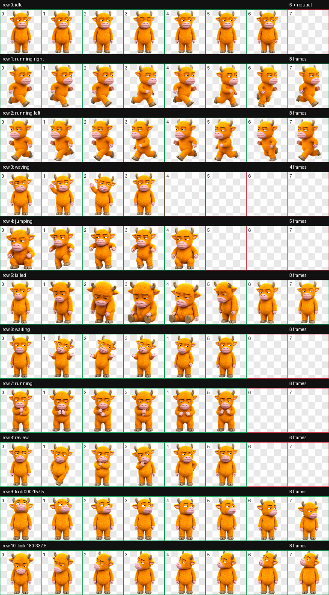

<p align="center">
  
</p>

<h1 align="center">牛来·毛绒增强版</h1>

<p align="center"><strong>保留那张不想营业的脸，把动作和眼神补完整。</strong></p>

> 这是基于 [sadlywo/niulai-codex-pet](https://github.com/sadlywo/niulai-codex-pet) 制作的非官方、非商业衍生版。完整来源、修改说明和许可边界见 [SOURCE_ATTRIBUTION.md](SOURCE_ATTRIBUTION.md) 与 [LICENSE](LICENSE)。

## 这版改了什么

- 保留 v1 的橙金色绒毛、半眯侧眼、紫粉色牛嘴与克制厌世感。
- 重新制作并强化 9 组 Codex 状态动画。
- 升级为 Codex v2 `8 × 11` 图集，增加顺时针 16 向注视。
- 保留独立 GIF、完整动作图、方向检查与验证结果。
- 与原版宠物并存，宠物 ID 为 `niulai-plush-v2`。

| 待机 | 挥手 | 正在工作 |
|:---:|:---:|:---:|
|  |  |  |



## 安装

### 从 Release 安装

1. 下载最新 Release 中的 `niulai-plush-v2.zip`。
2. 将压缩包解压到 Codex 宠物目录。

macOS / Linux：

```bash
unzip niulai-plush-v2.zip -d ~/.codex/pets
```

Windows PowerShell：

```powershell
Expand-Archive .\niulai-plush-v2.zip -DestinationPath "$env:USERPROFILE\.codex\pets" -Force
```

### 从仓库安装

macOS / Linux：

```bash
mkdir -p ~/.codex/pets/niulai-plush-v2
cp pet.json spritesheet.webp LICENSE SOURCE_ATTRIBUTION.md ~/.codex/pets/niulai-plush-v2/
```

Windows PowerShell：

```powershell
New-Item -ItemType Directory -Force "$env:USERPROFILE\.codex\pets\niulai-plush-v2" | Out-Null
Copy-Item pet.json,spritesheet.webp,LICENSE,SOURCE_ATTRIBUTION.md "$env:USERPROFILE\.codex\pets\niulai-plush-v2\"
```

安装后重启 Codex，在 **Settings → Pets** 中选择“牛来·毛绒增强版”。

## 动作协议

| 行 | 状态 | 帧数 | 用途 |
|---:|---|---:|---|
| 0 | `idle` | 6 | 呼吸、眨眼与轻微待机动作 |
| 1 | `running-right` | 8 | 向屏幕右侧拖动 |
| 2 | `running-left` | 8 | 向屏幕左侧拖动 |
| 3 | `waving` | 4 | 打招呼 |
| 4 | `jumping` | 5 | 跳跃或悬浮 |
| 5 | `failed` | 8 | 失败、取消或受阻 |
| 6 | `waiting` | 6 | 等待批准或用户输入 |
| 7 | `running` | 6 | 正在处理任务 |
| 8 | `review` | 6 | 检查已完成的结果 |
| 9–10 | `look` | 16 | 以 22.5° 为步长的顺时针注视 |

16 向注视是由 Codex 支持的交互状态驱动，不是操作系统级的全局鼠标追踪；普通鼠标移动本身不会让宠物持续追随。

## 技术规格与验证

- `spriteVersionNumber: 2`
- 图集：`1536 × 2288`、透明 RGBA WebP
- 网格：`8 × 11`，单帧 `192 × 208`
- 图集 SHA-256：`5f60685e9780300eebe5fb1df12e066e5337dd93365548adc1f25d787346e24d`
- 图集验证：通过，零错误、零警告
- 三名隔离盲测审阅者：基数方向全部通过
- 独立最终视觉 QA：通过；4 个中间斜向帧的纵向提示较含蓄，但无错象限或反转

方向总览见 [assets/look-directions.png](assets/look-directions.png)，机器验证记录见 [validation/](validation/)。

## 许可

美术资产仅允许用于个人、非商业的 Codex 宠物使用，并须保留上游署名。商业再分发、角色周边与转售需要另行取得上游作者许可。代码和元数据适用 `LICENSE` 中单独列出的条款；不要将整个仓库误认为 MIT 或其他宽松许可项目。

上游作者：`sadlywo`  
上游仓库：[sadlywo/niulai-codex-pet](https://github.com/sadlywo/niulai-codex-pet)  
固定来源提交：`177fd67dab1db63c7d82b1c1704e3959312afd17`
