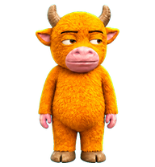
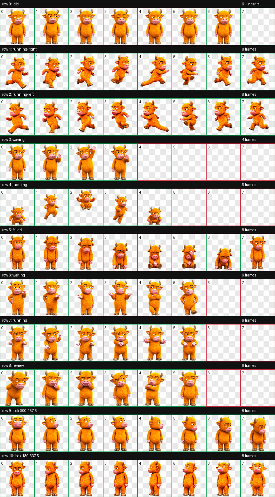

<p align="center">
  
</p>

<h1 align="center">牛来·互动版</h1>

<p align="center"><strong>还是那头不想营业的牛，只是这次它更会演了。</strong></p>

> 这是基于 [sadlywo/niulai-codex-pet](https://github.com/sadlywo/niulai-codex-pet) 制作的非官方、非商业衍生版。来源、修改说明与许可边界见 [SOURCE_ATTRIBUTION.md](SOURCE_ATTRIBUTION.md) 和 [LICENSE](LICENSE)。

## 动作设计

这版没有换角色，也没有改变牛来的厌世毛绒气质。重点是把 Codex 已有状态编成更完整、更有喜剧节奏的小表演：

| 状态 | 牛来的表演 | 实际触发或用途 |
|---|---|---|
| `idle` | 呼吸、耳朵轻抽、慢眨眼，最后无奈叹气 | 普通待机 |
| `running-right` | 重心前倾、左右腿交替的小跑 | 向屏幕右侧横向拖动 |
| `running-left` | 右跑动作的安全镜像，步态方向相反 | 向屏幕左侧横向拖动 |
| `waving` | 先愣一下，再勉强抬手扫两下 | 应用内部招呼状态 |
| `jumping` | 受惊压低、腾空、缩腿，再落地装镇定 | 鼠标悬停在宠物上 |
| `failed` | 僵住、垂头、瘫坐、捂脸，最后起身侧眼 | 失败、取消或受阻 |
| `waiting` | 摊手询问、抱臂、跺蹄催促 | 等待批准或用户输入 |
| `running` | 双手快速“空气键盘”，忙中带烦 | 正在处理任务 |
| `review` | 凑近看、托腮扫描、眯眼，再点头确认 | 检查已完成结果 |
| `look` | 以 22.5° 为步长连续转动头、鼻口与视线 | 应用内支持的注视目标 |



## 交互边界

当前 Codex 桌面端实际提供的是固定状态协议，宠物包只能设计每个状态“怎么演”，不能新增任意事件。因此：

- 悬停宠物会播放 `jumping`。
- 横向拖动约 4 px 后，会按方向播放 `running-right` 或 `running-left`。
- 单击宠物只会打开或聚焦输入框，不会触发专属点击动画。
- `running`、`waiting`、`failed`、`review` 由任务状态驱动；`waving` 是应用内部状态，不是点击手势。
- 16 向 `look` 会响应快捷聊天插入点、通知后的跟进输入点，以及 Computer Use 场景中的应用内光标，并只叠加在 `idle`、`running`、`waving` 状态；普通鼠标移动不是持续的全局追踪。
- 当前协议没有可由宠物包自定义的双击、随机事件或动作组合 API。

这些边界来自当前桌面端行为；未来 Codex 若扩展宠物协议，触发范围也可能随之变化。

## 安装

从 GitHub Release [下载 `niulai-interactive-v2.zip`](https://github.com/g5n-dev/newlai_pet/releases/download/v2.1.0/niulai-interactive-v2.zip)。

压缩包安装（macOS / Linux）：

```bash
unzip niulai-interactive-v2.zip -d ~/.codex/pets
```

从本目录安装：

```bash
mkdir -p ~/.codex/pets/niulai-interactive-v2
cp pet.json spritesheet.webp LICENSE SOURCE_ATTRIBUTION.md ~/.codex/pets/niulai-interactive-v2/
```

安装后重启 Codex，在 **Settings → Pets** 中选择“牛来·互动版”。它使用独立 ID `niulai-interactive-v2`，不会覆盖原版或“牛来·毛绒增强版”。

## 技术规格与验证

- Codex v2：`spriteVersionNumber: 2`
- 图集：`1536 × 2288`、透明 RGBA WebP
- 网格：`8 × 11`，单帧 `192 × 208`
- 9 组标准状态动画，共 57 个有效动作帧
- 16 向注视，共 16 个方向帧
- 图集结构、透明度与色键去边验证：通过
- 三名隔离盲测审阅者：四个基准方向全部通过
- 独立最终视觉 QA：通过

方向总览见 [assets/look-directions.png](assets/look-directions.png)，完整机器与视觉验收记录见 [validation/](validation/)，文件校验值见 [SHA256SUMS](SHA256SUMS)。

## 许可

美术资产仅允许用于个人、非商业的 Codex 宠物使用，并须保留上游署名。商业再分发、角色周边与转售需要另行取得上游作者许可。代码和元数据适用 `LICENSE` 中单独列出的条款；不要将整个包误认为 MIT 或其他宽松许可项目。

- 上游作者：`sadlywo`
- 上游仓库：[sadlywo/niulai-codex-pet](https://github.com/sadlywo/niulai-codex-pet)
- 固定来源提交：`177fd67dab1db63c7d82b1c1704e3959312afd17`
